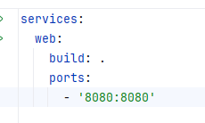
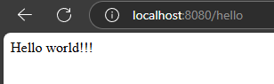

# Project Setup

This project is to test features of git actions and to build a complete CI/CD integration 

## Setup up git and docker on local

Open terminal `cmd`
Go to desired folder using `cd` command.

## Clone this repo on local using git 
`git clone https://github.com/pratikbanjare/git-action-test-lab.git`

## Build the project using maven 
`mvn clean package`

## Docker command to build image 
`docker build -t DOCKERUSERNAME/git_action_test_lab.jar:latest`

## Docker command to push the container to docker hub
`docker push -t DOCKERUSERNAME/git_action_test_lab.jar:latest`

Replace `DOCKERUSERNAME` with your docker username.

## Start application on docker and test the API 

Trigger from terminal `docker compose up`
This should start the application on VM. 
The port highlighted below allows us to expose a port from container / VM

Open Browser and go to https://localhost:8080/hello . The response should be like below image 
